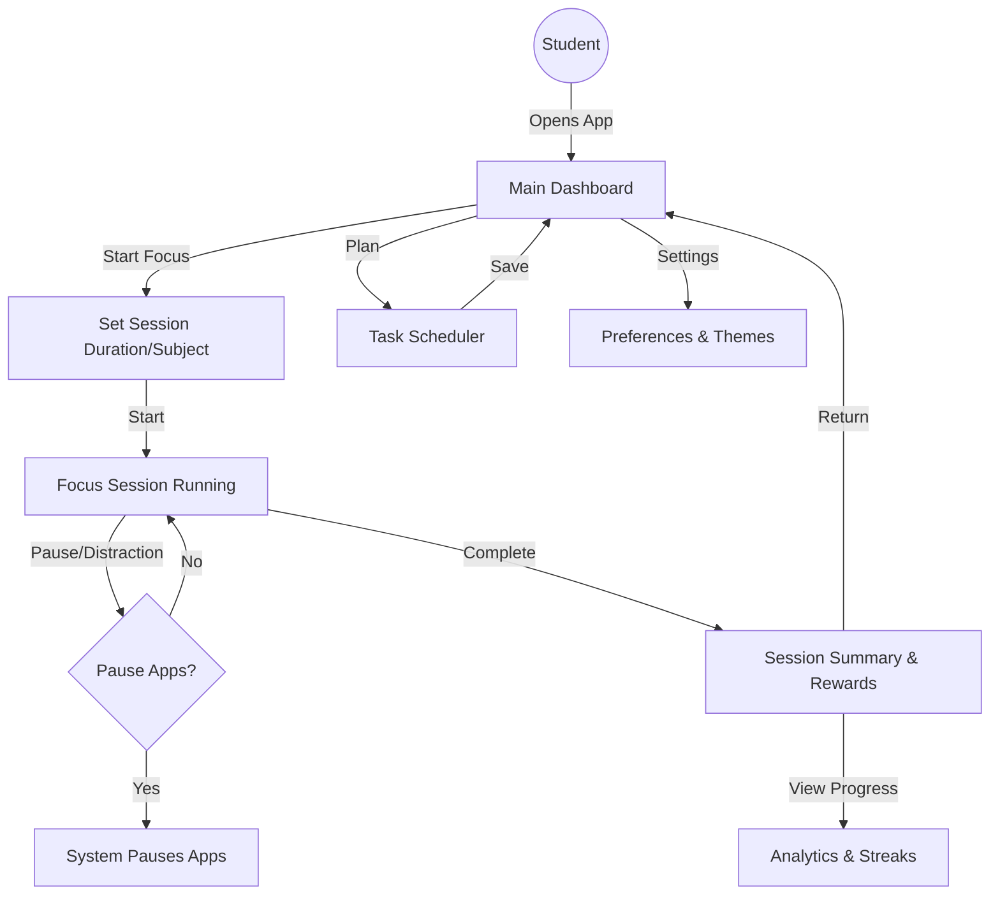

# masterplan.md

## 1. App Overview & Objectives

**App Name (placeholder):** FocusMate
**Objective:**
Help students improve **time management and focus** by providing gentle, supportive tools to manage distractions, track study habits, and build productive routines. The app combines **focus sessions, light personalization, advanced analytics, and gamification** to encourage sustained student engagement.

**Core Philosophy:**

* Supportive, not punitive
* Balanced control over distractions (pause apps, no blocking in Version 1)
* Personalized and gamified experience
* Data-driven insights while respecting privacy

---

## 2. Target Audience

* Primary: **Students (school/university)**
* Typical user scenario: Easily distracted by mobile apps, wants to track focus sessions, and improve study habits.
* Secondary: Could expand to **young adults** or **professionals** in future versions.

---

## 3. Core Features & Functionality

**Version 1 (MVP):**

1. **Focus Sessions** – Start and track focused study periods
2. **Temporary App Pausing** – Pause distracting apps during sessions (balanced control)
3. **Advanced Analytics** – Detailed tracking of app usage, study patterns, and trends
4. **Light Personalization** – Users can set session length, favorite subjects, notification preferences
5. **Session Insights** – Streaks, points, badges, daily/weekly progress reports
6. **Planning Tools** – Simple task/subject scheduling for upcoming sessions
7. **UX Enhancements** – Dark mode, theme selection, and optional social sharing

**Future Versions:**

* Full app blocking option for strict focus
* Integration with Google Calendar, Notion, fitness/mindfulness apps
* AI-based recommendations for optimal study times
* Collaborative or social study groups

---

## 4. High-Level Technical Stack Recommendations

**Platform:**

* Mobile-first: Android (primary), iOS (secondary)
* Optional web dashboard for analytics & planning

**Frontend:**

* Native mobile development or cross-platform frameworks (Flutter/React Native)

  * **Flutter:** Pros – single codebase, smooth UI; Cons – slightly larger app size
  * **React Native:** Pros – faster development if familiar with React; Cons – may require native modules for advanced analytics

**Backend & Analytics:**

* Cloud backend (Firebase / Supabase / AWS Amplify) for authentication, data sync, analytics

  * Firebase: Pros – realtime database, notifications, easy mobile integration; Cons – limited custom server logic
  * Supabase: Pros – SQL-based, scalable; Cons – newer ecosystem
* Local device storage for sensitive usage data (enhances privacy)

**Notifications & App Pausing:**

* Use native APIs to **temporarily pause selected apps**
* Push notifications for reminders, streaks, and session completions

---

## 5. Conceptual Data Model

**Entities:**

* **User:** id, name, preferences, subjects
* **FocusSession:** id, user_id, start_time, end_time, paused_apps
* **Analytics:** session duration, streaks, app usage stats
* **Tasks/Subjects:** name, scheduled_time, session_id
* **Gamification:** points, badges, milestones

**Relationships:**

* One user → many focus sessions
* One focus session → multiple tasks / paused apps
* One user → accumulated analytics & gamification data

---

## 6. UI/UX Design Principles

* **Friendly & supportive:** Gentle nudges, positive reinforcement
* **Minimalist interface:** Avoid overwhelming students
* **Gamified elements:** Streaks, badges, progress bars
* **Easy navigation:** Quick start for focus session
* **Customization:** Themes, dark mode, notifications preferences

---

## 7. Security & Privacy Considerations

* Explicit user consent for data collection
* Sensitive data stored locally first, optionally synced to cloud
* Data anonymization for analytics
* Transparent privacy policy with clear explanation of tracked data
* Optional login/authentication (email or social login)

---

## 8. Development Phases / Milestones

**Phase 1 (MVP):**

* Focus session & temporary app pause
* Basic analytics & session tracking
* Light personalization & notifications

**Phase 2:**

* Gamification, streaks, badges
* Planning tools & task/subject management
* Dark mode & themes

**Phase 3 (Expansion):**

* Full app blocking
* Advanced AI-driven suggestions
* Integrations: Google Calendar, Notion, fitness/mindfulness apps
* Social / collaborative features

---

## 9. Potential Challenges & Solutions

| Challenge                   | Solution                                                 |
| --------------------------- | -------------------------------------------------------- |
| Accurate app usage tracking | Use native APIs; test across devices                     |
| Privacy concerns            | Local storage first, clear consent, anonymized analytics |
| Student engagement          | Gamification, streaks, personalized insights             |
| Multi-platform UX           | Focus mobile first, web dashboard secondary              |
| Feature creep               | Prioritize core MVP features, expand gradually           |

---

## 10. Future Expansion Possibilities

* AI recommendations for optimal study times
* Multi-platform collaboration & social study groups
* Integration with other productivity tools (Notion, Google Calendar)
* Mindfulness and wellness features to improve focus and mental health
* Analytics dashboards for detailed insights & goal tracking

---

## 11. Visual User Flow

This **masterplan.md** gives you a complete blueprint to guide development and ensure a **cohesive, focused product**.
